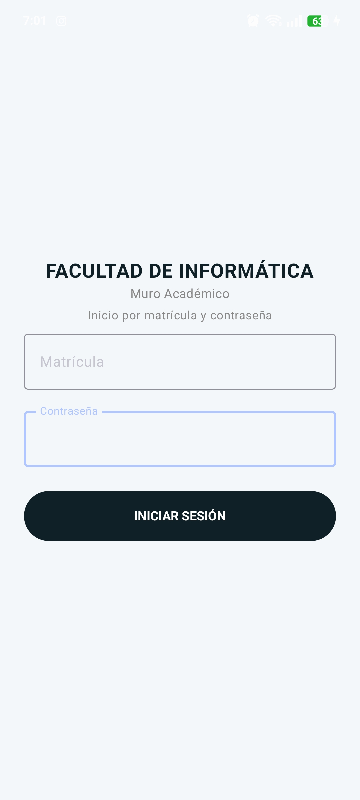
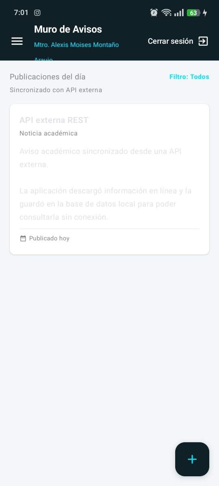
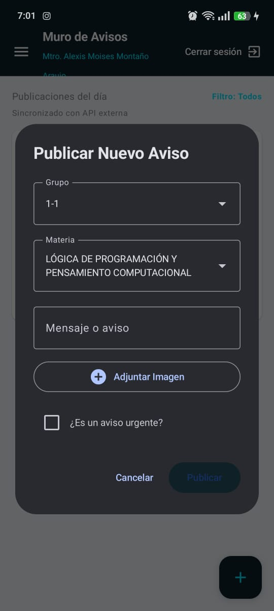

# Muro Académico FIC

Aplicación móvil desarrollada en **Android Studio** con **Kotlin** y **Jetpack Compose**. El proyecto funciona como un muro académico para que docentes publiquen avisos y alumnos puedan consultarlos desde una aplicación móvil.

---

## Descripción del proyecto

**Muro Académico FIC** es una aplicación académica creada para mejorar la comunicación entre docentes y alumnos. La app permite iniciar sesión, identificar el rol del usuario y mostrar un muro con avisos relacionados con materias, clases, actividades, comunicados y mensajes urgentes.

El proyecto también incluye una implementación de **persistencia local con SQLite** y una estrategia **offline-first**, lo que permite que la aplicación siga mostrando avisos guardados aunque no exista conexión a internet. Además, consume una **API REST externa** para sincronizar avisos de prueba y guardarlos localmente.

---

## Funcionalidades principales

- Inicio de sesión para usuarios registrados.
- Validación de usuario con matrícula y contraseña.
- Roles de usuario:
    - **Docente**
    - **Alumno**
- Muro de avisos académicos.
- Publicación de avisos por docentes.
- Visualización de avisos por alumnos.
- Avisos con:
    - Nombre del docente.
    - Materia.
    - Mensaje.
    - Indicador de urgencia.
    - Archivo o imagen adjunta mediante URI.
- Guardado de avisos en base de datos local SQLite.
- Consumo de API REST externa.
- Sincronización de avisos externos.
- Funcionamiento sin conexión mediante estrategia offline-first.
- Mensajes de estado para indicar si la app está sincronizada o trabajando sin internet.

---

## Arquitectura utilizada

El proyecto utiliza una estructura organizada por capas, tomando como base una arquitectura tipo **MVVM** y el patrón **Repository**.

La aplicación está dividida en:

```text
UI / Pantallas Jetpack Compose
        ↓
Repository
        ↓
Base de datos local SQLite
        ↓
API externa REST con Retrofit
```

### Capas principales

| Capa | Descripción |
|---|---|
| `ui/screens` | Contiene las pantallas y componentes visuales hechos con Jetpack Compose. |
| `data/local` | Contiene la base de datos local SQLite mediante `DatabaseHelper`. |
| `data/remote` | Contiene la configuración de Retrofit y el servicio para consumir la API REST. |
| `data/repository` | Centraliza la lógica para obtener avisos locales y sincronizar avisos externos. |
| `ui/theme` | Contiene colores, temas y tipografía de la aplicación. |

---

## Estrategia offline-first

La aplicación implementa una estrategia **offline-first**, lo que significa que primero trabaja con la información guardada localmente y después intenta sincronizar con internet.

Funcionamiento:

1. Al iniciar sesión, la app carga los avisos guardados en SQLite.
2. Después intenta conectarse a una API REST externa.
3. Si hay internet, descarga avisos externos y los guarda en la base local.
4. Si no hay internet, la app sigue funcionando con los datos almacenados previamente.
5. El usuario ve un mensaje de estado indicando si la sincronización fue exitosa o si está usando datos locales.

API utilizada:

```text
https://jsonplaceholder.typicode.com/posts
```

---

## Estructura del proyecto

```text
Aplicacion-Android-Studio/
│
├── README.md
├── IMPLEMENTACION_OFFLINE_FIRST.md
├── build.gradle.kts
├── settings.gradle.kts
│
├── app/
│   ├── build.gradle.kts
│   ├── CREDENCIALES_MURO_ACADEMICO.txt
│   │
│   └── src/main/
│       ├── AndroidManifest.xml
│       │
│       ├── java/com/fic/mobile_app_base_compose/
│       │   ├── MainActivity.kt
│       │   ├── BioBitacoraApp.kt
│       │   │
│       │   ├── data/
│       │   │   ├── local/
│       │   │   │   └── DatabaseHelper.kt
│       │   │   │
│       │   │   ├── remote/
│       │   │   │   ├── AvisoApiDto.kt
│       │   │   │   ├── AvisoApiService.kt
│       │   │   │   └── RetrofitClient.kt
│       │   │   │
│       │   │   └── repository/
│       │   │       └── AvisosRepository.kt
│       │   │
│       │   ├── ui/
│       │   │   ├── screens/
│       │   │   │   ├── Aviso.kt
│       │   │   │   ├── DialogoNuevoAviso.kt
│       │   │   │   ├── LoginScreen.kt
│       │   │   │   ├── MuroAvisosScreen.kt
│       │   │   │   ├── TarjetaAviso.kt
│       │   │   │   ├── User.kt
│       │   │   │   └── interfaz_UI.kt
│       │   │   │
│       │   │   └── theme/
│       │   │       ├── Color.kt
│       │   │       ├── Theme.kt
│       │   │       └── Type.kt
│       │   │
│       │   ├── viewmodel/
│       │   └── util/
│       │
│       └── res/
│           ├── drawable/
│           ├── mipmap/
│           └── values/
│
└── docs/
    └── screenshots/
```

---

## Tecnologías empleadas

- **Kotlin**
- **Android Studio**
- **Jetpack Compose**
- **Material 3**
- **SQLite**
- **SQLiteOpenHelper**
- **Retrofit**
- **Gson Converter**
- **Kotlin Coroutines**
- **Coil Compose**
- **Gradle Kotlin DSL**
- **Git y GitHub**

---

## Requisitos previos

Antes de instalar y ejecutar el proyecto se necesita:

- Android Studio instalado.
- JDK 11 o superior.
- Gradle configurado desde Android Studio.
- Emulador Android o celular físico con depuración USB activada.
- Conexión a internet para probar la sincronización con la API externa.

---

## Instrucciones de instalación

### 1. Clonar el repositorio

```bash
git clone https://github.com/Paulrofe/Aplicacion-Android-Studio.git
```

### 2. Entrar a la carpeta del proyecto

```bash
cd Aplicacion-Android-Studio
```

### 3. Abrir en Android Studio

1. Abre **Android Studio**.
2. Selecciona **Open**.
3. Busca la carpeta del proyecto.
4. Abre el proyecto.
5. Espera a que termine la sincronización de Gradle.

### 4. Sincronizar Gradle

Si el proyecto no sincroniza automáticamente:

1. Ve a **File**.
2. Selecciona **Sync Project with Gradle Files**.
3. Espera a que Android Studio descargue las dependencias.

### 5. Ejecutar la aplicación

1. Selecciona un emulador o conecta un celular físico.
2. Presiona **Run**.
3. Espera a que la app compile e inicie.

---

## Permisos utilizados

El proyecto utiliza el permiso de internet para consumir la API REST externa:

```xml
<uses-permission android:name="android.permission.INTERNET" />
```

---

## Dependencias principales

El proyecto utiliza dependencias para Jetpack Compose, Material 3, Retrofit, Gson y corrutinas.

Ejemplo de dependencias importantes:

```kotlin
implementation("com.squareup.retrofit2:retrofit:2.11.0")
implementation("com.squareup.retrofit2:converter-gson:2.11.0")
implementation("org.jetbrains.kotlinx:kotlinx-coroutines-android:1.8.1")
implementation("io.coil-kt:coil-compose:2.5.0")
```

---

## Capturas de pantalla

Las capturas deben colocarse dentro de la carpeta:

```text
docs/screenshots/
```

### Pantalla de inicio de sesión



### Muro de avisos



### Publicación de nuevo aviso




---


---

## Base de datos local

El proyecto utiliza SQLite mediante la clase:

```text
data/local/DatabaseHelper.kt
```

La base de datos contiene principalmente dos tablas:

| Tabla | Descripción |
|---|---|
| `usuarios` | Guarda usuarios con matrícula, nombre, rol y contraseña. |
| `avisos` | Guarda avisos creados localmente y avisos sincronizados desde la API. |

Campos principales de la tabla `avisos`:

- `id`
- `apiId`
- `docente`
- `materia`
- `mensaje`
- `esUrgente`
- `archivoUri`
- `origen`
- `fecha`

---

## API externa REST

La app consume la API pública de JSONPlaceholder:

```text
https://jsonplaceholder.typicode.com/posts
```

Archivos relacionados:

```text
data/remote/AvisoApiDto.kt
data/remote/AvisoApiService.kt
data/remote/RetrofitClient.kt
```

La información externa se convierte en avisos académicos y se guarda en la base de datos local.

---

## Estado actual del proyecto

El proyecto ya cuenta con:

- Interfaz principal con Jetpack Compose.
- Pantalla de login.
- Muro de avisos.
- Publicación de avisos.
- Base de datos local SQLite.
- Consumo de API REST externa.
- Repositorio para centralizar datos locales y remotos.
- Estrategia offline-first.

---

## Comandos útiles de Git

Ver estado de cambios:

```bash
git status
```

Agregar cambios:

```bash
git add .
```

Crear commit:

```bash
git commit -m "Actualizar README del proyecto"
```

Subir cambios:

```bash
git push
```

---

## Creadores

Paul Enrique Rodriguez Fernandez

Jose Daniel Meza Felix


---

## Licencia

Uso académico.
